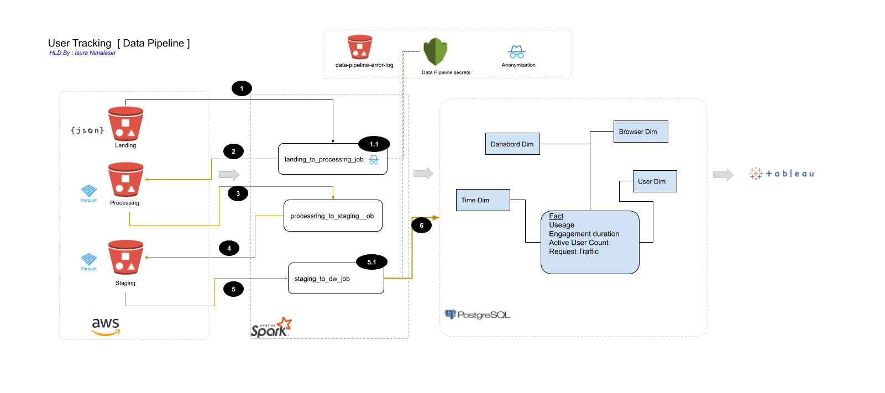
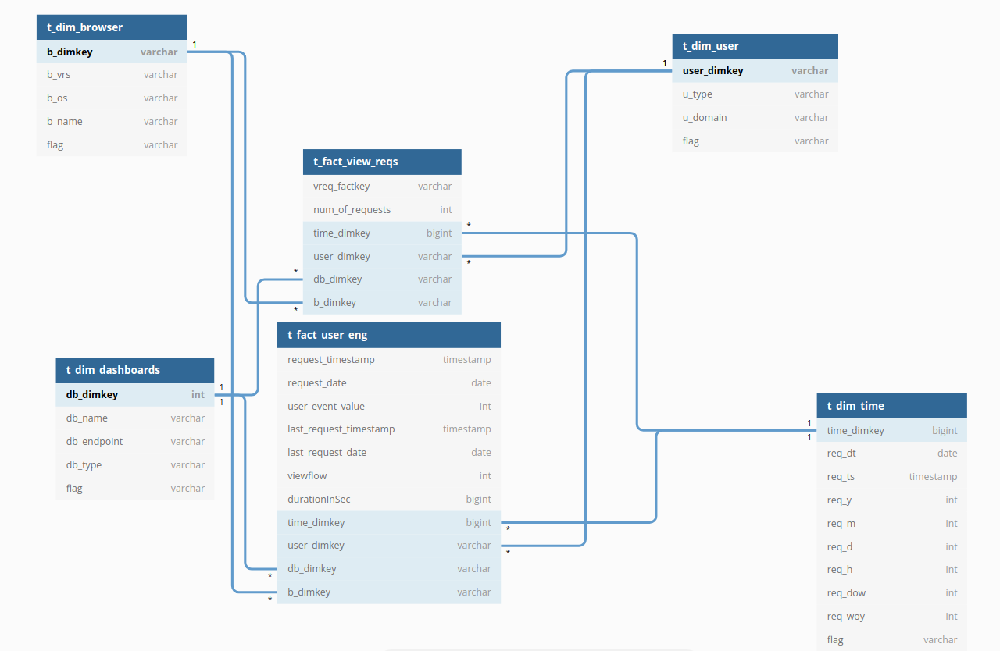

# Unmind-Assginment


## Overview
This pipeline is build for analysing user requests. The high level design given below describe how the data move 
from source to data warehouse.



| Step | Description |
|------|-------------|
| 1    | Read raw data from Landing bucket |
|1.1|    Data set including sensitive data (email). This step convert the email into hash value |
| 2 | Write data into Processing bucket before writing the spark job do validation (datatype) and add standardization |
|3 | Read from Processing bucket and transform data according to DW table format |
| 4 | Write data into Staging bucket |
| 5 | Read data from Staging bucket. This step can be avoided by database bulk upload command |
|5.5 | Get database username and password from secret manager |


## Requirement for Pipeline

1. Clone the repository
2. Install python3.7 or above in your environment
https://realpython.com/installing-python/
3. Install docker and docker-compose 
https://docs.docker.com/engine/install/
https://docs.docker.com/compose/install/
4. Install python package manager
https://pip.pypa.io/en/stable/installation/ 
5. Create python3 Virtual Envrioment

```
    python3 -m venv venv
    source venv/bin/activate
```
6. Install pyspark https://spark.apache.org/docs/latest/api/python/getting_started/install.html

```buildoutcfg
pip install pyspark
```

## Pipeline Execution Step

Note : This example is not running in spark cluster mode but in standalone. Therefore running using `spark-submit` is not required.

#### Start PostgreSQL DB

```buildoutcfg
# Step 01 : open new terminal and go inside to the postgresql_mimic dir
cd postgresql_mimic/
docker-compose up

# Step 02 : open another terminal and go inside to the postgresql_mimic dir
cd postgresql_mimic/
./psql.sh

# this script help you to execute queries from postgres container
# Ex: 
==================     Help for psql   =========================
\dt             : Describe the current database
\t [table]      : Describe a table
\c              : Connect to a database
\h              : help with SQL commands
\?              : help with psql commands
\q              : quit
==================================================================
psql (13.0 (Debian 13.0-1.pgdg100+1))
Type "help" for help.

utracker=# 
```
#### Start Spark Jobs

|Job Name | Execution Command  |
|---------|---------------------------------|
|landing_to_processing_job |`python3 spark_mimic/jobs/landing_to_processing_job.py`|
|processing_to_staging_job `| `python3 spark_mimic/jobs/processing_to_staging_job.py`|
| staging_to_dw_job|`python3 spark_mimic/jobs/staging_to_dw_job.py`|

## Data Warehouse Diagram




